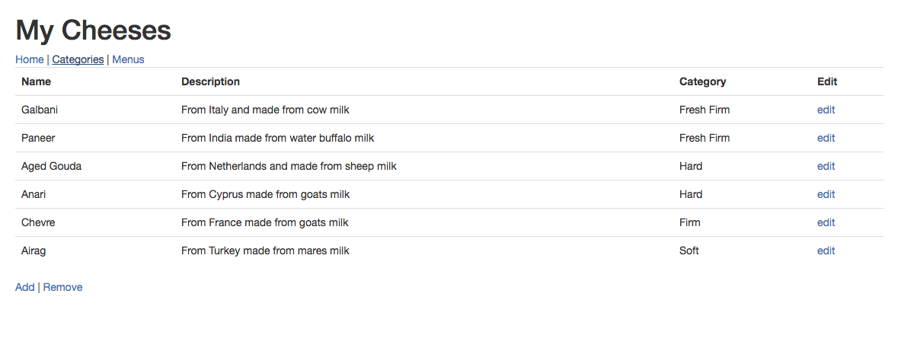
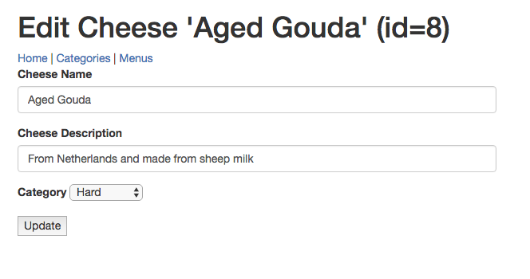
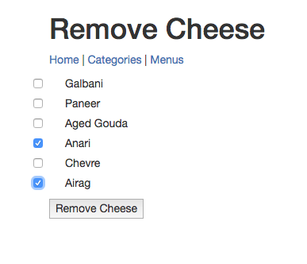
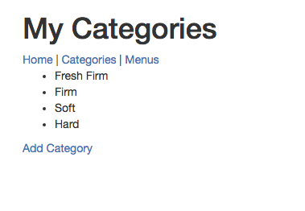
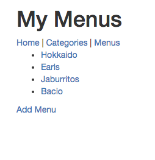
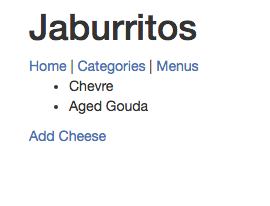
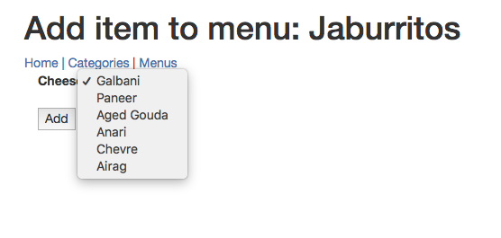

# cheese-mvc-persistent
Java / Spring Boot studio

Web application developed using Java Spring Boot, Spring Data, Java Persistent API, Hibernate and Thymeleaf template engine to perform CRUD operations on data stored in a MySQL database. 

